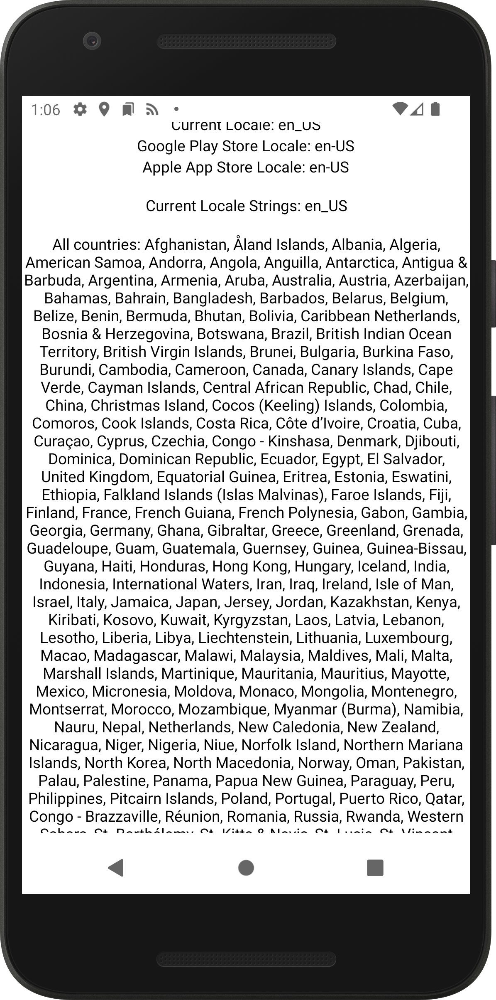
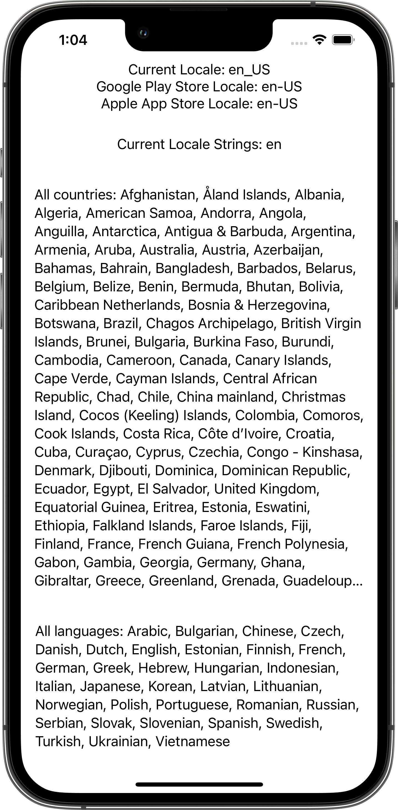

Multiplatform Locale
====================

A Type Safe Kotlin Multiplatform Locale implementation for your Android App, iOS / Mac App & JVM Backend.

| `Android`                             | `iOS`                         | `JVM`                         |
|:--------------------------------------|:------------------------------|:------------------------------|
|  |  |  |

# Usage

From Kotlin Multiplatform:

```groovy
kotlin {
  sourceSets {
    val commonMain by getting {
      dependencies {
        implementation("com.vanniktech:multiplatform-locale:0.1.0")
      }
    }
  }
}
```

From Android / JVM Multiplatform:

```groovy
dependencies {
  implementation("com.vanniktech:multiplatform-locale:0.1.0")
}
```

From iOS:

```ruby
pod 'MultiplatformLocale', :git => 'https://github.com/vanniktech/multiplatform-locale', :tag => "0.1.0"
```

# API

Use `com.vanniktech.locale.Locales`, `com.vanniktech.locale.Country`, `com.vanniktech.locale.Language` & `com.vanniktech.locale.Locale` directly in your platform specific code:

- [sample-android](./sample-android/src/main/kotlin/com/vanniktech/locale/sample/android/LocaleMainActivity.kt)
- [sample-ios](./sample-ios/ios/App.swift)
- [sample-jvm](sample-jvm/src/main/java/com/vanniktech/locale/sample/jvm/LocaleJvm.kt)

# License

Copyright (C) 2022 - Niklas Baudy

Licensed under the Apache License, Version 2.0
